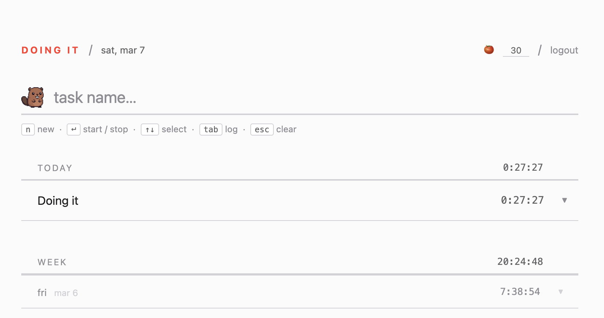

# Doing It

A minimal, keyboard-driven time tracker inspired by Notational Velocity.



## Running locally

**Prerequisites:** [Postgres.app](https://postgresapp.com) running on port 5432.

Create the database (one-time):

```bash
createdb tt
```

Copy the environment template and start the server:

```bash
cp .env.example .env
uvicorn app:app --reload
```

Navigate to [http://localhost:8000](http://localhost:8000). You'll be prompted to sign up on first run.

The `.env` file is gitignored. `DATABASE_URL` and `SECRET_KEY` are loaded from it automatically on startup.

## Testing

Create the test database (one-time):

```bash
createdb tt_test
```

Install dev dependencies and run the suite:

```bash
pip install -r requirements-dev.txt
pytest
```

Tests use transaction-per-test rollback for fast, isolated runs against a real Postgres instance. No mocking of the database layer.

End-to-end checks for the static UI live under `tests/e2e/` (Playwright). With Node 18+, from the repo root: `npm install` then `npx playwright test tests/e2e/task-crud.e2e.mjs` (or another file in that folder).

CI runs automatically on every push and pull request via GitHub Actions.

## Deploying to Fly.io

The app is designed to run on Fly.io's free tier — it hibernates when idle and wakes on the first request.

**1. Install the Fly CLI and log in**

```bash
curl -L https://fly.io/install.sh | sh
fly auth login
```

**2. Create the app and provision a Postgres database**

```bash
fly launch --name tt-<yourname> --region iad --no-deploy
fly postgres create --name tt-<yourname>-db
fly postgres attach tt-<yourname>-db
fly secrets set SECRET_KEY="$(openssl rand -hex 32)"
```

**3a. (Optional) Enable password reset emails**

The app uses [Resend](https://resend.com) for transactional email. Without these secrets the forgot-password flow silently skips sending — everything else works normally.

```bash
fly secrets set RESEND_API_KEY="re_..."
fly secrets set RESEND_FROM="noreply@yourdomain.com"
fly secrets set APP_URL="https://tt-<yourname>.fly.dev"
```

`RESEND_FROM` must be an address on a domain you have verified in the Resend dashboard.

**4. Deploy**

```bash
fly deploy
```

The app will be available at `https://tt-<yourname>.fly.dev`. Redeploy after code changes with `fly deploy`.

## Guest mode

New visitors land on the tracker immediately — no sign-up required. Tasks are stored in `localStorage` under the key `tt_guest_tasks` and survive page reloads. A banner at the top of the page reminds guests that their data is local and offers a one-click path to sign up. A "sign in" button also appears in the header.

**How it works**

1. On load, if there is no `tt_token` in `localStorage`, the app loads guest data from `localStorage` and renders it directly — no redirect to an auth screen.
2. The auth form is a modal overlay (`position: fixed`, `z-index: 200`) that floats above the tracker rather than replacing it. Pressing `Escape` dismisses it.
3. When a guest signs up with email/password and has existing local tasks, those tasks are POSTed to `/data` immediately after signup (before clearing the guest key). The local data becomes the user's server-side data, so nothing is lost.
4. Logging out switches back to guest mode: the `tt_token` is removed, local guest tasks reload, and the banner reappears.

**Local testing**

1. Open the app in a private/incognito window (no existing token).
2. You should see the tracker with the guest banner and "sign in" in the header — no login screen.
3. Add a task, reload — the task should still be there.
4. Click "Sign up" in the banner, create an account — the modal should close and your tasks should carry over.
5. Log out — the tracker should stay visible with the guest banner, showing the same local tasks.

## Google SSO

The app supports sign-in with Google as an alternative to email/password. Both methods coexist — existing password accounts are unaffected. Accounts are matched by email: if the Google account email already exists in the database, that account is used; otherwise a new one is created with `password_hash = NULL`.

**How it works**

1. The frontend loads the [Google Identity Services (GIS)](https://developers.google.com/identity/gsi/web) SDK and fetches the client ID from `GET /auth/google/client-id`.
2. GIS renders a "Sign in with Google" button. When the user picks a Google account, GIS returns a signed ID token in the browser.
3. The frontend POSTs the token to `POST /auth/google`. The server verifies it server-side with `google-auth` and returns the same JWT the rest of the app uses.

**Setup**

1. Go to [Google Cloud Console](https://console.cloud.google.com) → APIs & Services → Credentials → Create credentials → OAuth 2.0 Client ID (Web application).
2. Add your origin(s) as **Authorised JavaScript origins** (e.g. `http://localhost:8000`, `https://yourapp.fly.dev`). No redirect URIs are needed.
3. Copy the client ID.

**Environment variables**

| Variable | Default | Description |
|----------|---------|-------------|
| `GOOGLE_CLIENT_ID` | *(empty)* | OAuth 2.0 client ID from Google Cloud Console. If empty, the button is hidden and the endpoint returns 501. |

**Local setup**

```bash
fly secrets set GOOGLE_CLIENT_ID="<your-client-id>"   # production
# or add to .env for local dev:
echo 'GOOGLE_CLIENT_ID=<your-client-id>' >> .env
```

Leave `GOOGLE_CLIENT_ID` unset to disable Google sign-in entirely — no button appears and no JS errors occur.

## Password reset

The app has a built-in forgot-password flow using [Resend](https://resend.com) as the email provider.

**How it works**

1. User clicks "forgot password?" on the sign-in screen and submits their email.
2. If the email matches an account, a signed one-time token is stored in `password_reset_tokens` (expires in 60 minutes) and an email is sent with a link like `https://yourdomain.com/?token=<token>`.
3. Opening that link shows a "set new password" form. On submit the token is marked used and the password hash is updated.
4. The response is always `{"ok": true}` regardless of whether the email exists, to avoid leaking account information.

**Environment variables**

| Variable | Default | Description |
|----------|---------|-------------|
| `RESEND_API_KEY` | *(empty)* | API key from [resend.com](https://resend.com). If empty, emails are skipped silently. |
| `RESEND_FROM` | `noreply@doingit.online` | Sender address — must be on a domain verified in Resend. |
| `APP_URL` | `https://doingit.online` | Base URL prepended to the reset link in emails. Set to `http://localhost:8000` for local testing. |

**Local testing without email**

Leave `RESEND_API_KEY` unset. After submitting the forgot-password form, grab the token directly from the database:

```sql
SELECT token FROM password_reset_tokens ORDER BY expires_at DESC LIMIT 1;
```

Then open `http://localhost:8000/?token=<token>` manually to reach the reset form.

## Usage

| Key | Action |
|-----|--------|
| Type | Search existing tasks or name a new one |
| `↵` | Start/stop the matched task — or create and start a new one if no match |
| `⇧↵` | Start the matched task **in parallel**, without stopping the running one |
| `↑` `↓` | Navigate the task list |
| `Tab` | Expand/collapse today's session log for the selected task |
| `Esc` | Clear the search — or stop **all** running tasks when the search is empty |
| `#` | Optional tag: type `task name` then `#tagname` (space optional). Autocomplete appears after `#`. |

You can also click any task row to start/stop it, and hover to reveal the `✕` delete button.

**Tags (discovery)**

The search placeholder shows an example with `#`. While the search field is focused, the hint row shows keyboard shortcuts for the search field. After you create **three new tasks without a tag**, the beaver mascot may show a short tip (at most **twice** per browser)—e.g. *“add a tag like this: task #work”*; dismiss with **×** or by clicking outside the mascot area. As soon as you **create a new task that includes a tag** (`#something`), the tip closes and will not appear again — same as if you had dismissed it twice. Dismissals are stored in `localStorage` under `doingit_tag_tip_dismissals` (older builds used `doingit_project_tag_tip_dismissals`; the app migrates that value once on read).

By default starting a new task stops the current one. Hold `Shift` to start a task alongside the ones already running — see "Parallel tracking" below.

## Parallel tracking

You can track several tasks at the same time — useful when you genuinely work in parallel (a long build running under one task while you review code under another).

**How it works**

1. A plain start (`↵`, a number key, or clicking `▶`) keeps the old behavior: it stops the currently running task and starts the new one.
2. Holding `Shift` starts the task *without* stopping the others: `⇧↵` in the search field, `Shift`+number key, `Shift`+click on `▶`, or `⇧↵` on a row in keyboard-navigation mode.
3. Each running task shows its own live session timer and highlight; the header `● recording` dot is on while at least one task runs.
4. `Esc` (with an empty search) stops all running tasks at once. Stopping a single task is unchanged: press its number / `↵` / `▶` again. Logging out closes every open session.
5. With the pomodoro enabled, each running task gets its own independent timer, armed from that task's session start.
6. Each parallel session counts toward the free tier's 5-sessions-per-day limit individually.

The main page's "today" and week totals are plain sums across tasks, so an hour spent running two tasks counts as two hours there. The monthly report shows both readings — see below.

**Report: total with and without overlap**

The monthly report (`/report`, and the shared `/shared/{token}/report`) shows two totals:

| Total | Meaning |
|-------|---------|
| **Total** | Sum of all task time. An hour with two tasks running counts as 2h. |
| **Without overlap** | Wall-clock time spent tracking: overlapping sessions are merged and counted once. |

The two are equal if you never track in parallel. The backend returns the merged figure as `no_overlap_ms` in `GET /report/monthly`; the guest report computes it locally from `localStorage`.

## Seed data

`seed.py` populates a user's tasks with two weeks of realistic sessions — useful for testing the history view without waiting for real usage to accumulate.

```bash
python3 seed.py --email you@example.com
```

It reads `DATABASE_URL` from `.env` by default. To target a different database:

```bash
python3 seed.py --email you@example.com --db postgresql://localhost/tt
```

It generates sessions across the last 10 weekdays for five built-in tasks (`deep work`, `email & slack`, `code review`, `meetings`, `planning`) and also adds historical sessions to any existing tasks already in the account (`React Query`, `Interview Prep`). Safe to re-run — it never removes existing tasks or sessions, only adds new ones.

## Done items

Later items can be marked as done. Each later item shows a green ✓ button (to the left of the red ✕) that moves the item to the "Done" list.

**How it works**

1. Clicking the ✓ on a later item removes it from the Later list and records it as done with the current timestamp.
2. A "See all Done" link appears below the Later list, linking to `/done-list`.
3. The Done page shows all completed items sorted newest-first with infinite scroll (50 items per page).
4. Stats at the top of the page show: average done per week over the last 10 weeks, done this week, and done this month.
5. Guest users' done items are stored in `localStorage` (`tt_guest_done`). Signed-in users' done items are stored in the `done_items` table.

**API endpoints**

| Method | Path | Description |
|--------|------|-------------|
| `POST` | `/done` | Mark an item as done (`{id, text}`) |
| `GET` | `/done?offset=0&limit=50` | Paginated list of done items |
| `GET` | `/done/stats` | Stats: `this_week`, `this_month`, `avg_per_week` |

## Shared profile

Logged-in users can share a read-only view of their tasks, history, done list, and monthly report with anyone via a unique link.

**How it works**

1. Click "share live view" in the top bar (next to the theme toggle). A popover opens with an Enable/Disable toggle.
2. Click "Enable" to generate a share link. The link appears in the popover with a "Copy" button.
3. The link looks like `https://doingit.online/shared/<uuid>`. Anyone who opens it sees the user's live tasks, history, done list, and monthly report — all read-only, no login required. The shared view polls every 5 seconds for live updates.
4. Click "Disable" to revoke the share token. Existing links stop working.
5. Viewers who are not logged in see a prominent call-to-action banner at the top inviting them to try Doing It.
6. All interactive elements (search, session controls, delete buttons, later input) are hidden in shared view. Data is fetched from public `/shared/{token}/*` endpoints that require no authentication.

**API endpoints**

| Method | Path | Description |
|--------|------|-------------|
| `GET` | `/share/status` | Check if sharing is enabled and get token (auth required) |
| `POST` | `/share/enable` | Generate or return existing share token (auth required) |
| `POST` | `/share/disable` | Revoke share token (auth required) |
| `GET` | `/shared/{token}/data` | Public: tasks, later items, theme, projects |
| `GET` | `/shared/{token}/done` | Public: paginated done items |
| `GET` | `/shared/{token}/done/stats` | Public: done stats and sparkline |
| `GET` | `/shared/{token}/report/monthly` | Public: 30-day time report |

## Task ordering

Today's tasks are ordered by most recently finished session. When you stop a running task, it stays at the top of the list. Running tasks always appear first, followed by tasks sorted by their latest completed session timestamp (descending). This means the task you just worked on is always easy to find.

## Later list drag-and-drop

Later (to-do) items can be reordered by dragging. Hover over an item to reveal the drag handle on the left (same position as the shortcut numbers in the task list). Drag an item up or down to change its position. New items are added at the top of the list.

## Data

All task data is stored per-user in a Postgres database. Locally this is the `tt` database on your Postgres.app instance. In production it's the Fly.io Postgres cluster attached to the app.

Tasks, sessions, and the “later” list are normalized into SQL tables. **`GET /data` returns them from those tables.** Task tags use the UI word **tag**; in stored JSON they still live under **`projects`** (list of tag definitions) and **`projectId`** on each task (same payload the client sends on `POST /data`). On read, the server merges that blob so tags **round-trip** with the rest of the payload—reloads and new devices see the same tags after sync.

## Files

```
index.html            — the app UI
app.py                — FastAPI server (auth, data API, static files)
server.py             — simple local server (no auth, reads/writes data.json)
seed.py               — populates data.json with two weeks of sample sessions
requirements.txt      — Python dependencies
requirements-dev.txt  — dev/test dependencies (pytest, httpx)
.env.example          — environment variable template (copy to .env for local dev)
tests/                — test suite
Dockerfile            — container build for Fly.io
fly.toml              — Fly.io configuration
```
